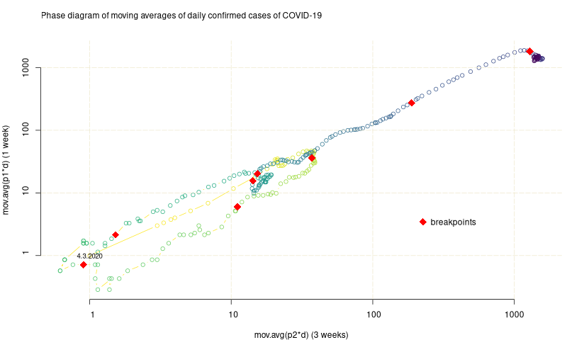
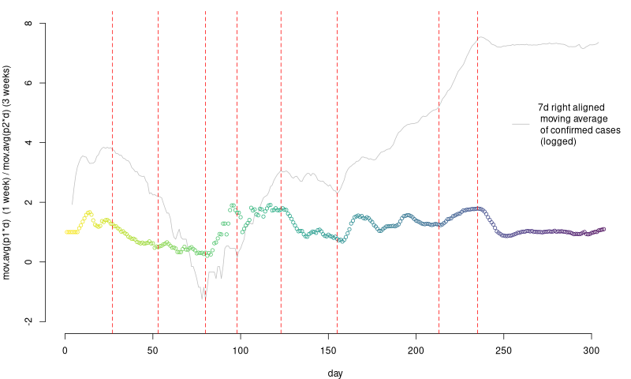

### exploring struccplot::breakpoints() to look for breaks in covid data

by [Luka Medic](https://github.com/luka-medic) ([implementacija mz](code/))(review [Žiga Brenčič](https://github.com/zigabrencic))

Jiang, Zhao & Shao (2020) [Time series analysis of COVID-19 infection curve: A change-point perspective](https://www.ncbi.nlm.nih.gov/pmc/articles/PMC7392157/pdf/main.pdf) (bral Nejc Davidović)

1. V  članku so vzeli `data=log(cases.confirmed.todate)`, gledali pa so prelome na linearnih odsekih `y~kx+n`.
2. `cases.confirmed.todate` (kumulativno potrjeni primeri) je "zvezna funkcija", ker je integral `cases.confirmed` (dnevno potrjeni primeri).
3. Ker je zvezna, ni mogoč prelom `n`. Prelomi se lahko samo `k`*. Kar ni nič drugega kot sprememba/prelom odvoda `y`.
4. To pomeni, da je ekvivalentno reševati problem: `data=diff(log(cases.confirmed.todate))` na konstantnih odsekih `y~k`.
5. V zvezni limiti velja: `diff(log(cases.confirmed.todate)) -> d/dx [log( integral(cases.confirmed) )] = cases.confirmed/integral(case.confirmed) = cases.confirmed/cases.confirmed.todate`
6. To pomeni, da v tistem članku niso delali nič drugega, kot z navadnim BP analizirali  `data=cases.confirmed/cases.confirmed.todate`.
7. Podatke lahko predstavimo tudi v faznem prostoru `(cases.confirmed, cases.confirmed.todate)`.
8. Mi pa že vemo, da `cases.confirmed.todate` hrani vso zgodovino primerov, kar je nepotrebno, saj tisti iz marca niso relevantni za trenutno dogajanje. Zato je smiselno nekje v zgodovini odrezati podatke, recimo nekaj period `p`, kjer je dolžina periode dolga `d=7` dni. Imamo `mov.avg(p*d)` z oknom `p*d` dni. (NB: `mov.avg(p*d) = mov.sum(p*d) / (p*d))`
9. Dobimo fazni prostor `(cases.confirmed, mov.avg(p*d))`, ekvivalentno pa lahko analizo ponovimo z BP na `time.series = cases.confirmed/mov.avg(p*d) `.

10. Lahko pa primerjamo različne periode: `(mov.avg(p1*d), mov.avg(p2*d))`, npr. `p1=1`, `p2=3`.
11. Narišemo lahko fazni prostor ali časovno vrsto (ki jo lahko analiziramo z BP).

*1. prelom `n`, 2. prelom `k`, 3. prelom `k` in `n`

